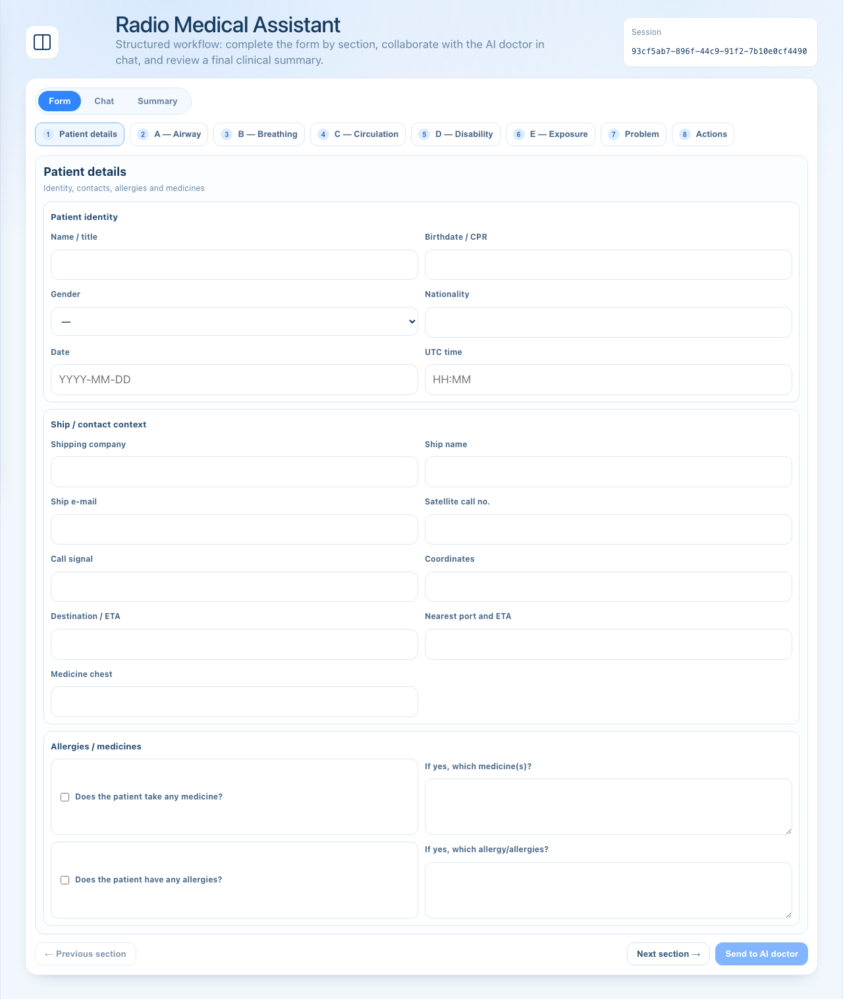

<!-- ============================================================ -->
<!-- FRONT PAGE (not included in main page count)                 -->
<!-- ============================================================ -->

<div align="center">

# Offline AI Radio Medical Report Reviewer

**Course:** Computer Science - AI apps

**Author:** Marcos Augusto

**Date:** May 2026

**GitHub:** [https://github.com/Socram25Otsugua/AI-project---Medical-Report](https://github.com/Socram25Otsugua/AI-project---Medical-Report)

---



*Figure 0.1 — Frontend: structured ABCDE form, chat with the AI doctor, and final summary workflow.*

</div>

<div style="page-break-after: always;"></div>

<!-- ============================================================ -->
<!-- TABLE OF CONTENTS (not included in main page count)          -->
<!-- ============================================================ -->

## Table of Contents

| Section | Page |
|---------|------|
| 1. Introduction and Problem Statement | 1 |
| 2. Model Choice, System Requirements, and Custom Model | 2 |
| 3. Prompts and Promptfoo Assertions | 3 |
| 4. Custom Ollama Model | 4 |
| 5. API Documentation | 5 |
| 6. Model Context Protocol (MCP) | 6 |
| 7. Guardrails, LLM-as-a-Judge, and Human-in-the-Loop | 7 |
| 8. Conclusion | 8 |
| **Appendix A** — Prompt Reference | A-1 |
| **Appendix B** — Promptfoo Configuration | A-2 |
| **Appendix C** — Environment Variables | A-3 |
| **Appendix D** — How to Export This Report to PDF | A-4 |

<div style="page-break-after: always;"></div>

<!-- ============================================================ -->
<!-- MAIN BODY (target: 5–10 pages when exported to PDF)          -->
<!-- ============================================================ -->

## 1. Introduction and Problem Statement

### 1.1 Project overview

This project delivers an **offline AI assistant for maritime Radio Medical training**. Participants complete a structured **Radio Medical Record (RMR)** form during simulation exercises. The system evaluates report quality, identifies clinical and documentation gaps, generates ABCDE-aligned treatment guidance, and supports a conversational “AI doctor” role-play aligned with Danish Radio Medical procedures.

The solution is deliberately **offline-first**: all inference runs locally via **Ollama**, retrieval uses a local **Chroma** vector store, and structured clinical signals are extracted through local **MCP tools** rather than cloud APIs. This matches training environments where connectivity is limited and patient data must remain on-premises.

### 1.2 Problem statement

Maritime medical officers must document patient assessments under pressure, often with incomplete information and limited shore-side support. Instructors need consistent, timely feedback on:

1. **Completeness** — Are ABCDE sections, vitals, problem description, and actions documented?
2. **Clinical safety** — Are abnormal vitals flagged and escalations considered?
3. **Actionable next steps** — What should the crew do now, monitor, and when to call Radio Medical again?
4. **Realistic telemedicine dialogue** — Can the trainee practice back-and-forth with an “AI doctor” before debrief?

Manual instructor review is time-consuming and varies between evaluators. Pre-written scenario responses lack adaptability when trainees omit key fields or document unexpected findings.

**Our goal:** Build a reproducible, offline pipeline that ingests a trainee report, enriches it with protocol context (RAG + MCP), produces structured JSON feedback through LangChain chains, and exposes it via a React UI with session history — while keeping a human instructor in the loop for final judgment.

### 1.3 Architecture summary

| Layer | Technology | Role |
|-------|------------|------|
| Frontend | React (Vite + TypeScript) | ABCDE form, chat, summary, history |
| Backend | FastAPI | REST API, orchestration entry points |
| LLM | Ollama (`llama3.1` default) | Review, response, patient eval, chat |
| Orchestration | LangChain | Prompt templates, JSON parsing, chains |
| RAG | Chroma + Ollama embeddings | Local guidelines and medicine chest |
| MCP | FastMCP + in-process tools | Vitals extraction, triage, checklist |
| Quality | Promptfoo + pytest | Prompt regression and unit tests |

<div style="page-break-after: always;"></div>

## 2. Model Choice, System Requirements, and Custom Model

### 2.1 Why Ollama and Llama 3.1

We selected **Ollama** as the inference runtime because it satisfies the offline requirement, supports structured JSON generation, and integrates cleanly with LangChain (`ChatOllama`, `OllamaLLM`, `OllamaEmbeddings`).

The default model is **`llama3.1`** with low temperature (0.1–0.2) for deterministic clinical outputs:

| Chain | Model env var | Temperature | Rationale |
|-------|---------------|-------------|-----------|
| Review / Response / Patient eval | `OLLAMA_MODEL` | 0.2 | Structured JSON; balance consistency and nuance |
| Chat doctor | `OLLAMA_CHAT_MODEL` | 0.1 | Conversational but stable tone |

**Why not a larger cloud model?** Training deployments may lack reliable internet; data residency and latency favour local inference. Llama 3.1 offers sufficient instruction-following for JSON schemas at modest hardware cost.

**Why not fine-tuning immediately?** Our domain knowledge is largely procedural (ABCDE, Danish maritime telemedicine). That knowledge is injected via **RAG** and **MCP** rather than weight updates, reducing data and compute requirements.

### 2.2 System requirements

| Component | Minimum | Recommended |
|-----------|---------|-------------|
| OS | macOS / Linux / Windows with WSL | macOS or Linux |
| Python | 3.11+ | 3.11+ |
| Node.js | 18+ | 20+ |
| Ollama | Latest, running locally | GPU-backed host for faster inference |
| RAM | 8 GB | 16 GB+ (LLM + Chroma) |
| Disk | ~5 GB (model + vector store) | SSD preferred |

**Runtime services:**

- Backend: `uvicorn app.main:app --reload --port 8000`
- Frontend: `npm run dev` → `http://localhost:5173`
- Ollama: `http://localhost:11434` with `llama3.1` pulled

### 2.3 Custom model: our approach and reasoning

We provide an **optional custom Ollama model** (`radio-medical-ai`) via a Modelfile that layers a domain system prompt and temperature on top of `llama3.1`. In production configuration we **default to the stock model** and rely on application-level system prompts, RAG, and MCP enrichment.

**Arguments for a custom model**

- Persistent domain persona without repeating long system prompts in every request.
- Slightly lower token usage per call.
- Easier hand-off to non-developer operators (`ollama create` once, set env var).

**Arguments against (why we kept it optional)**

- Prompt changes require rebuilding the model image rather than editing Python files.
- Promptfoo tests target `ollama:chat:llama3.1` directly; a custom tag adds another matrix dimension.
- Most behavioural control (JSON schemas, guardrails, vitals filtering) lives in **application code**, not base weights.
- For a training prototype, **prompt + RAG + MCP** delivered faster iteration than collecting fine-tuning data.

**Conclusion:** We document and ship the custom Modelfile for teams that want a packaged “Radio Medical AI” persona, but recommend stock `llama3.1` during development and Promptfoo CI unless profiling shows a measurable gain.

<div style="page-break-after: always;"></div>

## 3. Prompts and Promptfoo Assertions

### 3.1 Prompt inventory

The backend defines four primary system prompts (see Appendix A for full text):

| Prompt | File | Purpose |
|--------|------|---------|
| Review | `backend/app/prompts/review_form_prompt.py` | ABCDE deficiency review, completeness score, safety flags |
| Response | `backend/app/prompts/response_prompt.py` | Immediate actions, monitoring, escalation, follow-up questions |
| Patient evaluation | `backend/app/prompts/patient_eval_prompt.py` | Patient status (`ok` / `concerning` / `critical` / `unknown`) |
| Chat doctor | `backend/app/services/chat_service.py` | Radio Medical Denmark role-play with case status |

Each chain sends a JSON **user payload** containing `report_text`, `memory`, `rag_context`, and enriched `mcp` context. Outputs are parsed with LangChain `JsonOutputParser` bound to Pydantic schemas.

**Design principles embedded in prompts:**

- Do not invent missing vitals or history.
- Use MCP `field_presence` as hard evidence — do not mark documented fields as missing.
- Apply clinical threshold anchors (SpO₂, BP, temperature, consciousness).
- English-only output for instructor consistency.

### 3.2 Promptfoo setup

Prompt contract tests live in `promptfoo/` (see `promptfoo/README.md`) and run in CI (`.github/workflows/pr-checks.yml`). We use the **`ollama:chat:llama3.1`** provider with `temperature: 0.2` and `format: json`.

Layout:

- `prompts/` — review and response system prompts (aligned with `backend/app/prompts/`)
- `fixtures/` — synthetic RMR training reports and stub review JSON
- `assertions/` — reusable JavaScript schema checks
- `promptfooconfig.review.yaml` — review prompt regression
- `promptfooconfig.response.yaml` — response prompt regression

**Run locally:**

```bash
cd promptfoo
PLAYWRIGHT_SKIP_BROWSER_DOWNLOAD=1 npm install
export OLLAMA_BASE_URL="http://127.0.0.1:11434"
npm run test:prompts
```

### 3.3 Documented assertions

#### Review tests (`promptfooconfig.review.yaml`)

| Test | Fixture | Assertions |
|------|---------|------------|
| Complete ABCDE report | `fixtures/report_minimal.txt` | `contains-json`; `assertions/review-schema.cjs` validates score bounds and array fields |
| Undocumented vitals | `fixtures/report_missing_vitals.txt` | `contains-json`; `review-penalizes-incomplete-vitals.cjs` asserts `completeness_score <= 70` |

#### Response tests (`promptfooconfig.response.yaml`)

| Test | Fixtures | Assertions |
|------|----------|------------|
| Action plan for complete report | `report_minimal.txt` + `review_complete.json` | `contains-json`; `response-schema.cjs` validates `immediate_actions`, monitoring, escalation, rationale, and questions arrays |
| Vitals gap for sparse report | `report_missing_vitals.txt` + `review_sparse.json` | `contains-json`; `response-addresses-vitals-gap.cjs` asserts follow-up questions or vitals-related `immediate_actions` |

These assertions guard against model drift that returns non-JSON, drops required keys, or fails to penalize incomplete reports — without requiring exact string matches that would be brittle across stochastic LLM outputs.

<div style="page-break-after: always;"></div>

## 4. Custom Ollama Model

Although optional, we ship a **Modelfile** at `ollama/Modelfile`:

```dockerfile
FROM llama3.1

SYSTEM """
You are an offline clinical training assistant for maritime/remote medicine simulations.
You must produce structured JSON outputs when asked.
Never invent patient data; explicitly mark missing fields.
"""

PARAMETER temperature 0.2
```

**Create and use:**

```bash
cd ollama
ollama create radio-medical-ai -f Modelfile
export OLLAMA_MODEL=radio-medical-ai
export OLLAMA_CHAT_MODEL=radio-medical-ai
```

The custom model does **not** replace application prompts — it sets a baseline persona. Review, response, and patient-eval chains still attach their full system prompts and JSON schemas. This layering lets operators swap the base tag while preserving chain-specific instructions.

When the custom model is **not** used, behaviour is equivalent because the same constraints appear in Python prompt constants and in Promptfoo prompt files under `promptfoo/prompts/`.

<div style="page-break-after: always;"></div>

## 5. API Documentation

Base URL: `http://localhost:8000`  
API prefix: `/api/v1` (configurable via `API_PREFIX`)

### 5.1 Health

| Method | Path | Description |
|--------|------|-------------|
| `GET` | `/health` | Liveness check → `{"ok": true}` |

### 5.2 Report analysis

All report endpoints accept `ReportInput`:

```json
{
  "session_id": "uuid-string",
  "report_text": "Full RMR text or form render",
  "locale": "en-UK"
}
```

| Method | Path | Response | Description |
|--------|------|----------|-------------|
| `POST` | `/api/v1/reports/review` | `ReviewResult` | Deficiencies, safety flags, completeness and vitals scores |
| `POST` | `/api/v1/reports/respond` | `ResponseResult` | Treatment plan: actions, monitoring, escalation |
| `POST` | `/api/v1/reports/analyze` | `AnalyzeResult` | Full pipeline: review + response + patient evaluation |
| `POST` | `/api/v1/reports/chat-turn` | `ChatTurnResult` | Conversational turn with AI doctor |
| `POST` | `/api/v1/reports/finalize-summary` | `AnalyzeResult` | Full analysis then clears session conversation state |

**Chat turn** accepts `ChatTurnInput` (extends `ReportInput` with `user_message`).

**Example — analyze request:**

```bash
curl -X POST http://localhost:8000/api/v1/reports/analyze \
  -H "Content-Type: application/json" \
  -d '{"session_id":"demo-1","report_text":"Name: Test Patient\nSpO2: 93%\n..."}'
```

**Key response shapes:**

- `ReviewResult` — `extracted`, `deficiencies[]`, `safety_flags[]`, `completeness_score`, `vitals_score`, `vitals_feedback`
- `ResponseResult` — `immediate_actions[]`, `monitoring_parameters[]`, `escalation_criteria[]`, `rationale_bullets[]`, `questions_for_participants[]`
- `PatientEvaluation` — `status`, `summary`, `suspected_problems[]`, `red_flags[]`
- `ChatTurnResult` — `assistant_message`, `pending_questions[]`, `can_finalize_summary`

### 5.3 History (SQLite-backed)

| Method | Path | Description |
|--------|------|-------------|
| `GET` | `/api/v1/reports/history?limit=50` | List saved reports |
| `POST` | `/api/v1/reports/history` | Persist a report + result |
| `DELETE` | `/api/v1/reports/history` | Clear all history |
| `DELETE` | `/api/v1/reports/history/{report_id}` | Delete one entry |

CORS is enabled for `http://localhost:5173` (Vite dev server).

<div style="page-break-after: always;"></div>

## 6. Model Context Protocol (MCP)

We use MCP in two complementary ways: **deterministic FastMCP tools** for structured extraction, and **MCP-style context helpers** for RAG and session memory.

### 6.1 FastMCP server (`backend/rmrr_mcp/medical_mcp_server.py`)

Registered tools (invoked in-process via `app/tools/mcp_client.py`):

| Tool | Input | Output |
|------|-------|--------|
| `checklist_missing_sections` | `report_text` | ABCDE section presence, `field_presence` map |
| `extract_vitals` | `report_text` | HR, SpO₂, RR, BP, temperature via regex |
| `triage_priority` | `vitals` | `routine` / `urgent` / `critical` + risk markers |

**Run standalone:** `python -m rmrr_mcp.medical_mcp_server`

### 6.2 Context enrichment (`app/mcp/`)

`build_enriched_mcp_context()` merges:

- Vitals + triage + missing sections (from FastMCP tools)
- `guidelines_context` — RAG snippets from `medical_guidelines_mcp`
- `scenario_context` — detected scenario (trauma, cardiac, hypothermia, etc.)
- Session memory via `session_memory_mcp`

This bundle is injected into review, response, and patient-eval chains so the LLM receives **evidence-backed** context rather than guessing completeness.

### 6.3 Why MCP alongside RAG?

| Mechanism | Strength | Example |
|-----------|----------|---------|
| RAG | Semantic protocol retrieval | ABCDE escalation wording from guidelines |
| MCP tools | Deterministic parsing | Extract `SpO2: 93%` → numeric 93 |
| MCP checklist | Rule-based completeness | `field_presence.shipping_company == true` |

Combining both reduces hallucinated “missing field” findings — a recurring failure mode when LLMs alone review structured forms.

<div style="page-break-after: always;"></div>

## 7. Guardrails, LLM-as-a-Judge, and Human-in-the-Loop

### 7.1 Deterministic guardrails (`analysis_guardrails.py`)

After LLM output, we apply **rule-based filters**:

- **Contradiction filter** — Remove deficiencies/questions that claim a field is missing when regex/MCP shows it is present (e.g. shipping company, oxygen flow rate, pupil description).
- **Temperature filter** — Suppress hypothermia labels when documented temperature ≥ 35 °C.
- **Question deduplication** — Skip consciousness questions when AVPU/GCS already documented.
- **Response normalization** — Ensure non-empty `immediate_actions`, `monitoring_parameters`, and `escalation_criteria` with safe defaults.

Vitals scoring (`vitals_coverage_score`) is computed entirely from MCP extraction — not from LLM judgment — giving instructors an objective 0–100 metric.

### 7.2 LLM-as-a-Judge

We considered a dedicated **judge chain** that re-scores or rejects primary outputs. Current design **embeds judgment into the review and patient-eval prompts** instead of a separate judge pass, to limit latency on local hardware.

Promptfoo JavaScript assertions act as a **lightweight automated judge** in CI: they verify schema compliance and business rules (e.g. sparse reports must yield follow-up questions). This is not a full LLM-as-judge stack, but catches regressions cheaply.

**Trade-off:** A separate judge model (e.g. “critic” pass) would improve safety at ~2× inference cost. For offline training, we prioritised deterministic MCP + post-filters.

### 7.3 Human-in-the-Loop (HITL)

The UI workflow enforces instructor oversight:

1. **Form** — Trainee enters data; nothing is final until reviewed.
2. **Chat** — AI doctor asks follow-ups; `can_finalize_summary` is false while `pending_questions` remain.
3. **Summary** — Full analyze runs only when the trainee/instructor finalizes; results can be saved to history.

The system is advisory: it does **not** autonomously close cases or dispatch MEDEVAC. Chat prompts explicitly require Radio Medical sign-off formatting, reinforcing that outputs simulate training dialogue, not live clinical orders.

**Recommended HITL practices for deployment:**

- Instructor reviews all `critical` / `concerning` patient evaluations before debrief.
- Treat `completeness_score` and `vitals_score` as coaching metrics, not grades in isolation.
- Log and periodically audit saved history entries for systematic prompt failures.

<div style="page-break-after: always;"></div>

## 8. Conclusion

We delivered an offline Radio Medical training assistant that combines **LangChain orchestration**, **local RAG**, **MCP structured tools**, and a **React ABCDE form** with chat and summary views. The architecture addresses the core problem: scalable, consistent feedback on trainee documentation and clinical reasoning without cloud dependency.

**Key outcomes:**

- Structured JSON API for review, response, patient status, and conversational turns
- MCP-backed vitals extraction and completeness evidence reducing LLM contradictions
- Promptfoo regression tests wired into CI
- Optional custom Ollama model for operators who want a packaged persona

**Limitations and future work:**

- Regex vitals extraction misses unconventional phrasing; a hybrid NER model could help.
- No dedicated LLM judge pass — safety relies on prompts, MCP, and post-filters.
- Chat doctor quality depends on RAG coverage of the medicine chest corpus.
- Fine-tuning on annotated RMR pairs could reduce JSON format errors on smaller models.

For maritime simulation instructors, the system provides a practical copilot that accelerates debrief preparation while keeping humans accountable for final training judgments.

---

<!-- ============================================================ -->
<!-- APPENDICES (not included in main page count)                 -->
<!-- ============================================================ -->

<div style="page-break-after: always;"></div>

## Appendix A — Prompt Reference

### A.1 Review system prompt (excerpt)

Source: `backend/app/prompts/review_form_prompt.py`

- Framework: ABCDE + MCP `field_presence` as hard evidence
- Output: JSON with `deficiencies`, `safety_flags`, `completeness_score`
- Clinical anchors: HR 60–80 normal; SpO₂ &lt; 90% high risk; temp &lt; 35 °C hypothermia

### A.2 Response system prompt (excerpt)

Source: `backend/app/prompts/response_prompt.py`

- Outputs: `immediate_actions`, `monitoring_parameters`, `escalation_criteria`, `questions_for_participants`
- Prioritizes stabilization and escalation when safety flags present

### A.3 Patient evaluation prompt (excerpt)

Source: `backend/app/prompts/patient_eval_prompt.py`

- Status enum: `ok` | `concerning` | `critical` | `unknown`
- Must not invent missing vitals

### A.4 Chat doctor prompt (excerpt)

Source: `backend/app/services/chat_service.py`

- Persona: Radio Medical Denmark
- Output JSON: `reply`, `case_status`, `next_check_minutes`, `questions_for_participants`

<div style="page-break-after: always;"></div>

## Appendix B — Promptfoo Configuration

### B.1 Review config summary

File: `promptfoo/promptfooconfig.review.yaml`

```yaml
providers:
  - id: ollama:chat:llama3.1
    config:
      temperature: 0.2
      passthrough:
        format: "json"
prompts:
  - prompts/review.txt
```

### B.2 Response config summary

File: `promptfoo/promptfooconfig.response.yaml`

Same provider; prompt file `prompts/response.txt`.

### B.3 Fixtures

| File | Scenario |
|------|----------|
| `fixtures/report_minimal.txt` | Structured ABCDE report with documented vitals |
| `fixtures/report_missing_vitals.txt` | Sparse report with undocumented vitals |
| `fixtures/review_complete.json` | Stub review for response tests (complete case) |
| `fixtures/review_sparse.json` | Stub review for response tests (incomplete vitals) |

<div style="page-break-after: always;"></div>

## Appendix C — Environment Variables

| Variable | Default | Description |
|----------|---------|-------------|
| `APP_NAME` | `radio-medical-ai` | FastAPI title |
| `API_PREFIX` | `/api/v1` | Router prefix |
| `OLLAMA_BASE_URL` | `http://localhost:11434` | Ollama host |
| `OLLAMA_MODEL` | `llama3.1` | Chain model |
| `OLLAMA_CHAT_MODEL` | `llama3.1` | Chat doctor model |
| `OLLAMA_TEMPERATURE` | `0.2` | Chain temperature |
| `OLLAMA_CHAT_TEMPERATURE` | `0.1` | Chat temperature |
| `RAG_PERSIST_DIR` | `.chroma` | Vector store path |
| `RAG_COLLECTION` | `medical_training_kb` | Chroma collection name |

<div style="page-break-after: always;"></div>

## Appendix D — How to Export This Report to PDF

This report is **Markdown** and editable in Cursor, VS Code, or any text editor. You do **not** need Pandoc.

### Option 1 — Cursor / VS Code (easiest)

1. Install the **Markdown PDF** extension (`yzane.markdown-pdf`).
2. Open `docs/PROJECT_REPORT.md`.
3. Open the Command Palette (`Cmd+Shift+P`) → **Markdown PDF: Export (pdf)**.
4. Save the PDF next to the Markdown file.

If the screenshot does not appear in the PDF, use Option 2 or 3 instead (some exporters handle images better).

### Option 2 — Google Docs

1. Open [Google Docs](https://docs.google.com).
2. **File → Import** and upload `docs/PROJECT_REPORT.md`, or copy-paste the content.
3. Fix headings and paste the screenshot manually if needed (`docs/assets/frontend-screenshot.png`).
4. **File → Download → PDF Document (.pdf)**.

### Option 3 — Microsoft Word (Mac)

1. Open Word → **File → Open** → select `docs/PROJECT_REPORT.md`.
2. Adjust formatting (headings, page breaks).
3. Insert the screenshot on the front page if it did not import.
4. **File → Save As → PDF**.

### Option 4 — Browser print (no extra tools)

1. Push the Markdown to GitHub and view the rendered file in the browser, **or** use a free viewer such as [StackEdit](https://stackedit.io) or [Dillinger](https://dillinger.io) and paste the content.
2. Use **Print → Save as PDF** (`Cmd+P` on Mac).
3. Enable “Background graphics” so the screenshot prints.

### Optional — install Pandoc later

If you want a command-line workflow in the future:

```bash
brew install pandoc basictex
cd docs
pandoc PROJECT_REPORT.md -o PROJECT_REPORT.pdf \
  --pdf-engine=xelatex \
  -V geometry:margin=2.5cm \
  -V fontsize=11pt
```

### Before submission checklist

- [x] Course and student name filled in on the front page
- [ ] Confirm screenshot renders on the front page
- [ ] Export PDF and verify main body is **5–10 pages** (front matter and appendices excluded)
- [ ] Run `npm run test:prompts` in `promptfoo/` and attach results if required

---

*End of report*
